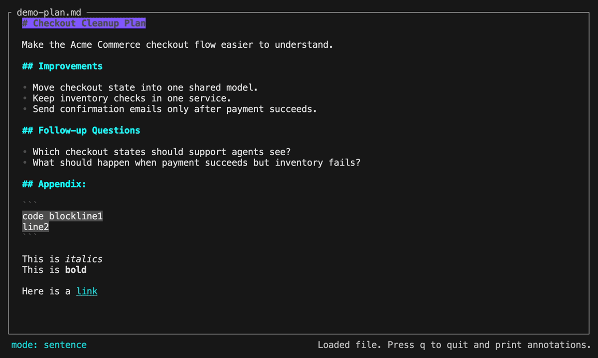

[](https://github.com/mattorb/rep/actions/workflows/ci.yml)
[](LICENSE)

# Rep

A human in the loop TUI to revise markdown plan files quickly in collaboration with an LLM.  It is **made for use inside a tmux session** wrapping an agent tool like Claude Code or Codex. This is the way.



## Overview

`rep` opens a markdown file in an interactive terminal UI optimized for providing feedback and requesting changes.  On quit of the app, it prints out list a changes requested, for an AI agent.

For a seamless experience, launch Codex or Claude Code inside a tmux session, which allows rep to launch as modal and automatically pass the results into the agentic loop.

**Why not just talk to the LLM asking for the changes I want**
You can try, but to really target your changes and apply a whole series of them in one shot, you will end up having to provide lots of context.   Rep automatically includes context of _where_ in the plan you are requesting any given change.

## Installation

Install the latest release with:

```sh
curl -fsSL https://raw.githubusercontent.com/mattorb/rep/main/install.sh | sh
```

The installer:
- Detects your platform (macOS/Linux, x86\_64/aarch64)
- Downloads the matching release archive from [GitHub Releases](https://github.com/mattorb/rep/releases)
- Verifies SHA-256 checksum against `checksums.txt`
- Installs `rep` to `~/.local/bin` by default
- Installs the bundled agent skill to `~/.agents/skills/rep` by default

Install locations can be changed with `REP_INSTALL_DIR` and `REP_SKILLS_DIR`.

## Usage

The BEST way to use this TUI tool is in the agentic loop, with a skill, immediately after you ask AI to help generate a plan (to a file) to accomplish a goal. This allows you to tap a few keys, put some feedback and requests in context quickly.

1. Ensure `rep` is on your PATH
2. Install the agent skill: `./install-skills.sh`
3. Launch tmux, and you Agentic coding tool inside of the tmux session.  Wrapping the agent in a tmux session is what allows rep to present modally and automatically continue the agentic loop on quit.
```
$ tmux new-session -t tryrep
$ claude
```
4.  Invoke the skill after generating a markdown plan file:

**Claude Code**
```
) generate a plan to accomplish [goal] and write it to a plan.md
...ai plans...
) /rep plan.md
...ai applies edits/feedback...
) 
```

**Codex**
```
> generate a plan to accomplish [goal] and write it to a plan.md
...ai plans...
> $rep plan.md
...ai applies edits/feedback...
>
```

## Platform Support

| Platform | Release artifact | CI coverage | Support status |
| --- | --- | --- | --- |
| macOS x86_64 | `x86_64-apple-darwin` | Build and tests on GitHub-hosted macOS | Supported |
| macOS arm64 | `aarch64-apple-darwin` | Cross-target release build on GitHub-hosted macOS | Supported |
| Linux x86_64 | `x86_64-unknown-linux-musl` | Build and tests on GitHub-hosted Ubuntu | Supported |
| Linux arm64 | `aarch64-unknown-linux-musl` | Cross-target release build on GitHub-hosted Ubuntu | Best effort |
| Windows | none | none | Not currently supported |

Release artifacts are limited to platforms that are either tested directly or built in CI with a documented support tier.

## Keybindings

| Key | Action |
| --- | --- |
| `i` / `o` | Cycle selection unit forward/backward |
| `j` / `k` | Move to next/previous anchor in the active unit |
| `c` | Request a change for the current selection |
| `f` | Add feedback for the current selection |
| `b` / `a` | Insert text before/after the current selection |
| `x` | Strike the current sentence |
| `[` / `]` | Jump to previous/next annotation |
| `O` | Reveal link under the current selection |
| `?` | Toggle help |
| `q` | Quit and emit action blocks |
| `Q` | Quit silently |

## Emitted Action Example

```text
FILE: plan.md

ACTION: change
WHERE: line 12 sentence 2
CONTEXT:
  prev: The release workflow builds archives for every configured target.
  target: Windows artifacts are published even though the installer and tests do not cover Windows.
  next: Checksums are generated after packaging.
CHANGE: Stop publishing Windows archives until CI and installer support are added.
```

## Development
```sh
./build.sh
# binary is at target/debug/rep
```

Additional release checks:

```sh
cargo doc --no-deps
cargo package --allow-dirty
cargo publish --dry-run
cargo audit
shellcheck build.sh install.sh install-skills.sh .agents/skills/rep/scripts/*.sh scripts/*.sh
```

Record the README demo GIF with:

```sh
scripts/record-demo.sh
```

## License
MIT — see [LICENSE](LICENSE).
