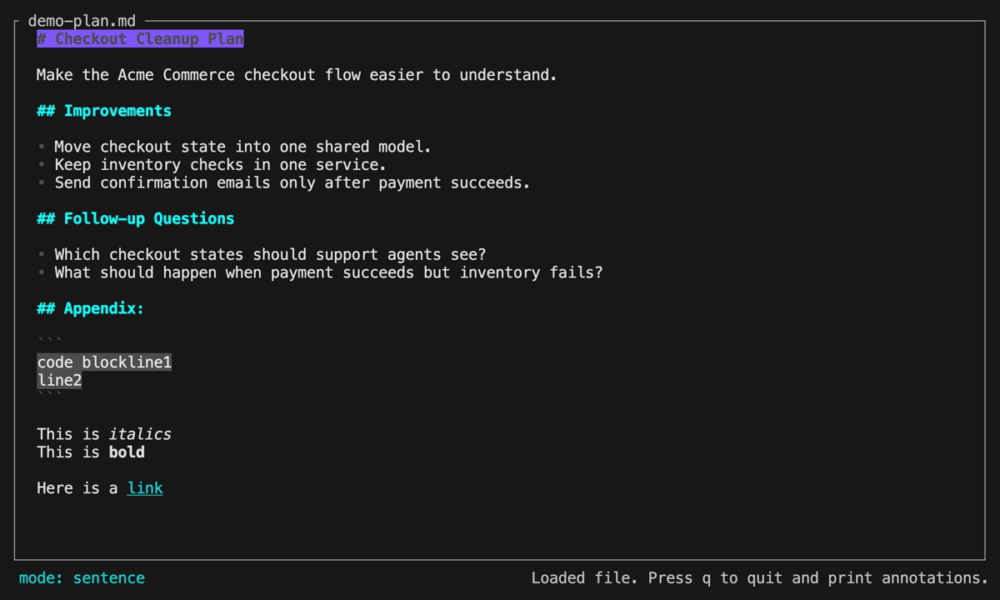

[](https://github.com/mattorb/rep/actions/workflows/ci.yml)
[](LICENSE)

# Rep

Rep is a human-in-the-loop plan reviewer with two deliberately separate
frontends:

- Markdown plans use the existing terminal UI.
- HTML plans use a foreground local web server and your browser, preserving
  the plan's original static layout and CSS.

Both frontends produce the same human-readable action protocol for an agent to
apply to the source plan.



The generated HTML review gallery is available at
[web/gallery/index.html](web/gallery/index.html).

## Installation

Install the latest macOS or Linux release to `~/.local/bin`, and the bundled
agent skill source to `~/.agents/skills/rep`:

```sh
curl -fsSL https://raw.githubusercontent.com/mattorb/rep/main/install.sh | sh
```

The installer can symlink the skill into supported Claude, Codex, Gemini,
opencode, Hermes, and Droid skill directories. To update only the skill:

```sh
curl -fsSL https://raw.githubusercontent.com/mattorb/rep/main/install.sh | sh -s -- --skills-only
```

Node is needed only for repository web tests, never to install or run a Rep
release.

## Usage

Use `/rep` in Claude Code or `$rep` in Codex for the complete review-and-apply
loop. The bundled skill selects the frontend from the plan extension and waits
for the fresh review result.

Run either frontend directly with:

```sh
rep plan.md
rep --web plan.html
```

Markdown keeps its existing extensionless and non-`.md` behavior. HTML and HTM
extensions are matched case-insensitively and require `--web`; `--web` rejects
every other extension.

For a browser you want to open yourself, including an SSH-forwarded session:

```sh
rep --web --no-open plan.html
```

Rep prints the authenticated loopback URL to stderr. Keep the foreground
process running, open that exact URL, and submit or discard the review in the
browser. A compact HUD stays visible at the bottom of the review, showing the
current selection mode and the `?` help shortcut. `--debug` validates and
describes an HTML launch without binding a server or opening a browser.

The built-in `rep --demo` remains Markdown/TUI-only. An HTML example lives at
[`examples/demo-plan.html`](examples/demo-plan.html); the opt-in
`scripts/record-web-demo.sh` generates a browser demo video when development
dependencies and Chromium are installed.

For the complete agent loop, `scripts/record-claude-rep-html-demo.sh` records
the actual interactive Claude Code terminal through VHS while macOS's built-in
`screencapture` utility records the active display. The compositor crops that
recording to the headed Chromium window, including its real tabs, toolbar,
address bar, and window frame. VHS visibly types the plan request and `/rep`;
it hides long Claude generation/application waits and ends before the cleanup
`/quit`. After Claude creates a real draft,
`scripts/claude-rep-html-demo-plan.html` replaces it with a deterministic plan,
matching the Markdown demo's fixture-swap approach. The browser recording opens
Rep's keyboard help and shows the actual keyboard and pointer events before
Claude applies the fresh review actions. No synthetic terminal, browser chrome,
or third-party screen recorder is used.

The recorder requires an installed, authenticated Claude Code CLI and the
locked web dependencies. Grant Screen & System Audio Recording permission to
the app running the script, restart that app if macOS requests it, and keep the
logged-in desktop unlocked during capture. The script keeps the display awake
while recording; pinned VHS, tmux, ttyd, and ffmpeg tooling is resolved through
mise/pkgx. It produces
[`docs/rep-claude-html-skill-demo.mp4`](docs/rep-claude-html-skill-demo.mp4)
and [`docs/rep-claude-html-skill-demo.gif`](docs/rep-claude-html-skill-demo.gif).

## HTML rendering and safety

Rep renders the reviewed document in a sandboxed iframe while its toolbar,
dialogs, status, and completion screen stay in a separate parent shell. The
served copy retains original elements, inline styles, style sheets, images,
fonts, and responsive CSS. Rep does not rewrite the source file.

The safety boundary is intentionally static:

- Document JavaScript, event-handler attributes, forms, nested frames,
  plugins, navigation, downloads, refresh, and CSP/base overrides are removed
  or blocked in the served copy.
- Relative stylesheets, images, and fonts are served only when their canonical
  paths remain beneath the HTML file's directory. Symlink escapes and
  `../` traversal are rejected.
- Data-URI images and fonts work. Remote and root-relative resources are
  blocked and counted in the non-modal status line.
- HTML must be UTF-8 and at most 10 MiB. Local assets are capped separately.
- The server binds only to `127.0.0.1`, uses a fresh 256-bit URL token, and
  accepts same-origin requests for that session.

Rep is a review tool, not a trusted-content browser. JavaScript-dependent
layouts are not supported, while original static HTML/CSS layout is preserved
as closely as the safety boundary permits.

## HTML selection model

Review order follows visible DOM order, independent of CSS columns or viewport
wrapping. Hidden content, generated pseudo-element content, canvas/image
pixels, and plan-owned shadow DOM are not selectable.

The five shared units retain the same cycle:

```text
Section -> Paragraph -> Line -> Sentence -> Word
```

For HTML, a paragraph is one extracted visible review block; a line is split
only by `<br>` or a preformatted newline; sentences and words use the same
segmenters as Markdown. Sections follow heading depth, with the existing
top-level ordered-list rule before the first heading. Click once for a word,
twice for a sentence (or logical line where applicable), and three times for
the whole review block.

Selections and annotations are painted as isolated overlay rectangles rather
than wrappers inserted into the plan DOM, so responsive layout and original
CSS selectors remain intact.

## Keybindings

The same navigation and annotation keys apply in both frontends. `I` opens the
Markdown AST or an HTML outline with element, source-line, and text context.
`O` reveals both original and resolved link targets associated with the
current selection.

| Key | Action |
| --- | --- |
| `j`, `Down`, `Right` | Move to the next active unit |
| `k`, `Up`, `Left` | Move to the previous active unit |
| `Space` | Cycle to the next selection unit |
| `Backspace` | Cycle to the previous selection unit |
| `i` | Use a finer selection unit |
| `o` | Use a coarser selection unit |
| `c` | Add or edit a literal change request |
| `f` | Add or edit feedback or intent |
| `b` | Insert text before the current unit |
| `a` | Insert text after the current unit |
| `x` | Clear existing annotations or mark the unit for deletion |
| `e` | Edit an existing annotation |
| `[`, `]` | Jump to the previous or next annotation |
| `/` | Search |
| `n`, `N` | Jump to the next or previous search match |
| `?`, `Shift` + `/` | Open or close help |
| `I` | Open or close the document structure view |
| `O` | Reveal links for the current selection |
| `r` | Copy annotations to the clipboard |
| `q` | Quit and print annotations to stdout |
| `Q` | Quit silently and discard annotations |
| `Enter` | Save text in change, feedback, insert, edit, or search modes |
| `Esc` | Cancel the current input mode or close an open popup |

## Completion and troubleshooting

Submitting prints all actions to stdout, closes the listener, and leaves a
self-contained completion message in the tab. Silent discard prints nothing.
Closing or reloading the tab does not end the foreground process; reopen the
same URL to restore the in-memory session. An open review tab sends a
background heartbeat; a session with neither browser nor HTTP activity times
out after 24 hours, and interruption exits without partial actions. If
clipboard permission is denied, `r` opens the complete output in a selectable
fallback dialog with a Copy button.

- If the browser opener is unavailable, Rep prints the URL and keeps serving;
  open it manually or start with `--no-open`.
- When a resource is reported blocked, make it relative to the plan directory
  and keep its canonical target inside that directory. Remote and
  root-relative URLs are intentionally unsupported.
- Over SSH, use `--no-open` and forward the printed loopback port securely.
  The path token is required, so copy the entire URL.
- If a stale tab says the review is unavailable, its foreground Rep process
  has finished or timed out. Start a new review to receive a fresh URL.
- If the layout depends on document JavaScript, create a static exported HTML
  plan instead; Rep never enables plan scripts.

## Emitted annotations

Markdown output remains compatible with existing consumers:

```text
FILE: plan.md

ACTION: change
WHERE: line 12 sentence 2
CONTEXT:
  prev: The release workflow builds archives for every configured target.
  target: Windows artifacts are published even though tests do not cover them.
  next: Checksums are generated after packaging.
CHANGE: Stop publishing Windows archives until support is added.
```

HTML action blocks add their format and a source locator while keeping the same
action names and payloads:

```text
FILE: plan.html
FORMAT: html

ACTION: change
WHERE: line 18 sentence 1
LOCATOR: #release-plan
CONTEXT:
  prev: Scope is fixed for this iteration.
  target: Publish every target immediately.
  next: Checksums follow packaging.
CHANGE: Gate publishing on the supported target matrix.
```

`WHERE` is a source-line hint. For HTML, the bundled skill resolves the
original unique ID or structural locator and verifies normalized visible
target and neighboring context before editing.

## Platform support

| Platform | Release artifact | CI coverage | Support status |
| --- | --- | --- | --- |
| Linux x86_64 | `x86_64-unknown-linux-musl` | Build, package, archive/installer/web smoke tests on GitHub-hosted Ubuntu | Supported |
| Linux arm64 | `aarch64-unknown-linux-musl` | Cross-build, package, archive/installer/web smoke tests on GitHub-hosted Ubuntu | Supported |
| macOS x86_64 | `x86_64-apple-darwin` | Native build/tests plus browser release checklist | Supported |
| macOS arm64 | `aarch64-apple-darwin` | Cross-target release build plus browser release checklist | Supported |

Linux release artifacts are static MUSL builds. The browser UI's HTML, CSS, and
JavaScript application assets are embedded in the Rep binary.

## Development

The project pins Rust and Node with mise:

```sh
mise install
mise exec -- npm --prefix web ci
mise exec -- ./build.sh
mise exec -- npm --prefix web run test:e2e
```

See [`docs/release-checklist.md`](docs/release-checklist.md) for cross-browser
and packaged-release validation.

## License

MIT — see [LICENSE](LICENSE).
